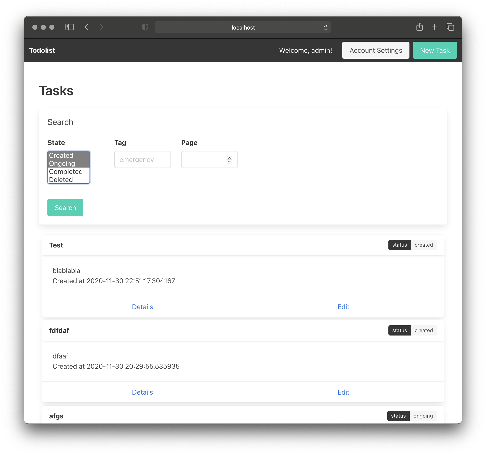

# システム設計演習: Report B
**2020/10/31 18B14118 松浦 幹人**

アプリケーションは課題締め切り後以下のURLで公開する．
ソースコードは一部しか引用しないので，引用されていない部分は以下を参照していただきたい．
```
http://github.com/m1kit/sysdes-taskB
```


## 課題B-1 タスク管理アプリの概要
### [B-1.1] 作成したタスク管理アプリについて，スクリーンショットなどを用いてその機能をわかりやすく紹介せよ．ただし，提示された仕様の番号を明記するなど，紹介する機能と要求仕様の対応関係がわかるようにすること．
アプリケーションのトップページはルート`/`でアクセス可能である．
トップページへのアクセス以降，「全て」の操作は画面遷移なしで実現されている(SPA)．[S-2.6, S-2.7, S-2.8]

#### ユーザ管理関連機能[S-1.3, S-1.4]
未ログインのユーザは画面上部のNavbar上のボタンから以下のsignupページにアクセスできます．
あるいは，`http://localhost:9000/#signup` にアクセスすることで同様のページを表示できます．

このページでは，ユーザ名とパスワードを入力することで新規登録が可能です．
ユーザ名が既に使われている場合や，ユーザ名・パスワードが長すぎたり短すぎたりする場合はエラーメッセージが表示されます．

同様に，未ログインのユーザは画面上部のNavbar上のボタンから以下のsigninページにアクセスできます．
あるいは，`http://localhost:9000/#signin` にアクセスすることで同様のページを表示できます．

このページでは，ユーザ名とパスワードを入力することでログインが可能です．
ユーザ名・パスワードが一致していない場合はエラーメッセージが表示されます．

ログインが完了すると，上部のNavbarが以下のように変化するとともに，現在のタスク一覧が表示されます．
このNavbarのボタンから新規タスク作成とアカウント設定が可能です．


このうち，アカウント設定画面ではユーザのパスワード変更・ログアウト・退会が可能です．
さきほどと同様に，パスワードが短すぎる場合はエラーが表示されます．

#### タスク関連機能
ユーザはログイン後以下のメイン画面(タスク一覧画面)を表示することができます．[S-1.1, S-1.2]
また，タグによる絞り込みと状態による検索機能を持ちます．[S-1.2, S-2.3]
更に，設定された締め切りが近い順にソートされているほか[S-2.1]，
簡単なページネーションが実装されているため5件ずつの表示になります[S-2.4]



ユーザは以下の画面から新規タスクを作成できます．
この際，タスクの状態をCreated(未着手)かOngoing(進行中)から選択できます．


タスク一覧画面でタスクの下にあるDetailボタンまたはEditボタンを押すとタスク詳細画面に遷移します．
(詳細画面と編集画面を兼ねているため，DetailボタンもEditボタンも同じ振る舞いをする)．


この画面ではタスクのより詳細な情報を確認できるほか，後から内容の編集が可能．
設定項目は以下の通り．

- Title: タイトル
- Description: 説明
- State: タスクの状態．以下の4つの値をとる
    - Created: 未着手
    - Ongoing: 進行中
    - Completed: 完了
    - Deleted: 破棄
- Created At: タスク作成日時．自動で設定される．．
- Completed At: タスク完了日時．自動で設定されるようにController側で実装する予定だが，まだ実装されていない．DBやAPIのモデル上には存在するが，常にNULLです．
- Deadline: タスク締め切り日時．自分で設定できる．
- Cyclic task: タスクの周期性を指定できる．タスクを完了した際に，この値が設定されている場合は自動的にタスクの複製が(異なる締め切りで)出現する仕様を実装しようとしていたが，こちらも未実装．モデルとしては存在しているので，Controller側の処理だけで実装できる段階．[S-2.2]
- Tags: タスクに紐づけられたタグ．いくつでも追加できるほか，削除も可能．
- Users: タスクを共有しているユーザです．ここに指定されたユーザがタスクを閲覧・編集できる．[S-2.5]

上にも書いてあるが，`Completed At`と`Cyclic task`は今現在機能していない．
もう少しで実装できる気がするが，「タスクの完了」を検知する実装に手こずっていて，間に合わなかった．

以上で紹介した中にもいくつかオリジナルの機能が含まれるが，それらに加えて今回はCSSを用いた見た目の整形も行った．
これは，上のスクリーンショットで確認できると思う．

## 課題B-2 タスク管理アプリの実装
### [B-2.1] DB内のテーブルの関係性を，図および文章によって示せ．
formappのものを除けば，DBのテーブルは以下のERDによって表される．


ユーザのモデルに対応するテーブル`user`には，ユーザの名前とダイジェスト化された認証情報が格納される．

同様に，タスクのモデルに対応するテーブル`task`にはタスクのタイトル・説明・状態などが格納される．
このテーブルにはカラムが多いので，少し説明を加える．
- `state`: `models.TaskState`に規定される整数でのコードが格納されている．例えば，0ならば`created`で2ならば`completed`である．
- `cycle`: 周期的タスクの場合は非NULLとなり，タスクの周期が秒単位で格納される．
- `deadline`, `completed_at`: それぞれ事前に設定した締め切りと，実際の完了時刻を示す．未完了の場合などはNULLを許容する．

タスクとユーザの所有関係はmany-to-manyを想定しているため，中間テーブル`task_user`を用いて関係を保存している．
また，タスクに対するタグの関係はone-to-manyであるため，別途`task_tag`テーブルで保存している．


### [B-2.2] 実装した機能について代表的なものを3つ程度選択し，それぞれユーザがその機能を使用する際のシーケンス図を示せ．ただし，「ユーザ」「アプリケーション」「DB」を対象とすること．
#### ユースケース1: タグによる絞り込み検索


#### ユースケース2: パスワードの変更


#### ユースケース3: 新規タグの設定


### [B-2.3] 各要求仕様に関して，実装した仕様の実現方法を，本演習を受講している他の学生にもわかるよう説明せよ．図やソースコードの抜粋などを用いてもよい．いくつかの機能をまとめて説明しても良いが，どの機能に対応した説明であるかを明示せよ．
#### API設計
本実装はJSONを用いたRESTfulなAPIをベースに実装されており，フロントエンド(ビュー)とバックエンド(モデル・コントローラ)が完全に分離されている．
バックエンドは`/api/`というエンドポイントで動的なデータを配信しており，フロントエンドは`/`というエンドポイントで静的なWebサイト(とJavaScript)を配信している．

この構成を具体例でもう少し詳しく説明する．
例えば，ID5番のタスクの詳細を表示する際には，フロントエンドのJavaScriptがAjaxを用いて`GET /api/tasks/5`というHTTPリクエストを行う．
これに対して，バックエンドは以下のようなJSON形式のデータで応答をする．
```
{
    "status": "OK",
    "data": {
        "id": 5,
        "title": "titletitletitletitle",
        "description": "descdescdescdescdesc",
        "state": "created",
        "created_at": "2020-11-30 20:29:55.535935",
        "users": [
            {
                "id": 3,
                "name": "admin",
                "created_at": "2020-11-30 20:20:27.680378"
            },
            {
                "id": 4,
                "name": "user",
                "created_at": "2020-11-30 21:14:26.836732"
            }
        ],
        "tags": [
            "cat",
            "doggo",
            "hoge"
        ]
    },
    "description": [
        "Success"
    ]
}
```

formappでは`application/x-www-form-urlencoded`で情報をやりとりしていたが，このようなJSON形式を用いることでより構造的なデータの受け渡しが可能である．
今回のアプリケーションのAPIレスポンスは全て以下のような構造になっている．
```
{
    "status": "OK",
    "data": "ここにAPIの結果が入る",
    "description": [
        "Success"
    ]
}
```

あるいは，何らかの理由で失敗すると以下のようになる．
```
{
    "status": "Fail",
    "data": {},
    "description": [
        "エラーの理由その1",
        "エラーの理由その2"
    ]
}
```

基本的には，フロントエンド側で必要に応じてAPIを叩き，成功した場合には画面を(JavaScriptで)再描画する．
APIを叩く際のAjax通信には[axios](https://github.com/axios/axios)というライブラリを利用した．

また．REST APIはセッションを用いたステートフルな通信を嫌う．
そこで，今回は[JWT](https://jwt.io/)を用いたステートレス通信に徹した．
Ajax通信のたびにHTTP通信のAuthorizationヘッダを通じて，署名されたトークンを受け渡すことによってユーザの認証を行なっている．
このような手法はCSRFの対策としても有用であるほか，JWTはトークンの有効性の検査にDBアクセスが不要なことから広く使われる技術であるので採用した．
(ちなみに，playのセッションもJWTをCookieに入れているらしい．)

JWTの発行はAPI`POST /api/credential`へユーザ名とパスワードをPOSTすることで行われる．
それ以外のAPIアクセスはAuthorizationヘッダを要求しているので，ログイン後ローカルストレージにJWTを保存する．
技術的には，バックエンド側で`actions.UserAction`という以下に示す`ActionRefiner`を通してそれを行なっているが，発展的なので説明が難しい．

```scala
class UserAction @Inject()(val parser: BodyParsers.Default)(val tokens: AccessTokens)(
    implicit val executionContext: ExecutionContext
) extends ActionBuilder[UserRequest, AnyContent]
    with ActionRefiner[Request, UserRequest] {
  override def refine[A](request: Request[A]): Future[Either[Result, UserRequest[A]]] = {
    request.headers
      .get("Authorization")
      .flatMap("^Bearer (.+)$".r.findFirstMatchIn)
      .map(ma => ma.group(1))
      .flatMap(tokens.decode) match {
      case None       => Future.successful(Left(Responses.Unauthorized))
      case Some(user) => Future.successful(Right(UserRequest(user, request)))
    }
  }
}
```

APIのエンドポイントは以下の通りである．
```
### User
POST          /api/users                          controllers.api.UserController.register()
POST          /api/credential                     controllers.api.UserController.login()
PUT           /api/users/me                       controllers.api.UserController.update()
DELETE        /api/users/me                       controllers.api.UserController.withdraw()
GET           /api/users/me                       controllers.api.UserController.me()

### Task
GET           /api/tasks                          controllers.api.TaskController.list()
POST          /api/tasks                          controllers.api.TaskController.create()
GET           /api/tasks/:task                    controllers.api.TaskController.detail(task: Int)
PUT          /api/tasks/:task                    controllers.api.TaskController.list
POST          /api/tasks/:task/users              controllers.api.TaskController.addUser(task: Int)
DELETE        /api/tasks/:task/users/:user        controllers.api.TaskController.removeUser(task: Int, user: String)
POST          /api/tasks/:task/tags               controllers.api.TaskController.addTag(task: Int)
DELETE        /api/tasks/:task/tags/:tag          controllers.api.TaskController.removeTag(task: Int, tag: String)
```

それぞれ，RESTの原則に従っており，タスクのGET, POST, PUTなどがそのままJSONで行われる．

#### 画面の遷移
Ajax通信の結果を用いての画面遷移には，React.jsのようなライブラリは利用せず，単純な手法を用いている．
フロントエンドで以下のようなページを配信しておき，"hidden"クラスを通じて各要素の`display: none`属性をJavaScriptで操作している．
```html
<section id="page1" class="hidden">
    <h1>ページ1</h1>
    ここは見えない．
</section>
<section id="page2">
    <h1>ページ2</h1>
    この状態だとここが見えている．
</section>
<section id="page3" class="hidden">
    <h1>ページ3</h1>
    ここは見えない．
</section>
```

このほかにも，細かい要素の操作をいくつか行なっている．

例えば，ログイン時のソースコードは以下のようになっている．
前半でフォームの入力情報を受け取り，Ajax通信を発行している．
その後，成功すればJWTをローカルストレージに保存し，それ以外の場合はエラーメッセージをID`errors`のタグの中に表示している．
```javascript
async function signin() {
    const name = document.getElementById('signin-name').value
    const password = document.getElementById('signin-password').value
    try {
        const resp = await http.post('/credential', {'name': name, 'password': password})
        localStorage.setItem('token', resp.data.data.token)
        localStorage.setItem('username', name)
        moveTo('tasks')
    } catch (err) {
        let html = ''
        for (let desc of response.description) {
            html += `<p class="help is-danger">${desc}</p>`
        }
        document.getElementById('errors').innerHTML = html
    }
}
```

#### 画面の整形
画面の整形には[bulma.io](https://bulma.io)というCSSライブラリを利用した．


## 課題B-3 発展課題
### [B-3.1] 開発手法について，「ウォーターフォール型」「反復型」および「アジャイル型」とはそれぞれどういった手法か，それぞれの違い・長所・短所を簡潔にまとめよ．
ウォーターフォール型開発とは，上流工程(設計)から下流工程(実装・評価)に向けて一方向に進行する開発手法である．
上流工程の段階でプロジェクトの計画を決定するため，スケジュール管理の見通しがしやすい一方で，
プロジェクト開始後に遅延や仕様変更が発生した場合の柔軟性に欠ける．
開始時点でプロジェクトの要求や納期が明確になっており，リスクが低い場合に向いている．

一方の反復開発では，まず第一に最低限のプロトタイプを作成する．
その後に，追加するべき機能や改善点を細かく分けて，設計・実装・評価を繰り返していく形式を取る．
これにより，プロジェクト開始後の要件変更にも柔軟に対応させられるが，
プロジェクトのスケジュールなど全体像の把握は難しくなる．

アジャイル開発は反復開発と似ている概念であり，設計・実装を反復して行う．
但し，プロジェクトを小機能ごとに分割して小機能ごとにリリースを行うことを強調している．
また，プロジェクト開始時に要求が明確である必要はなく，開発とリリースの反復を通して要求を明確にしていく思想を持っている．

### [B-3.2] SQL Injection とは何か，その危険性および対策法についてまとめよ．
SQL Injectionとは，ユーザ入力の不適切な処理によって意図せぬSQL文が実行されるというアプリケーションの脆弱性の一種である．
DBへのアクセスをライブラリに頼らずに行っていたり，ライブラリにバグがある場合に発生しうる．

アプリケーションはデータベースへのアクセスにSQL文を用いるが，この際SQL文を"動的に"生成するケースが数多く存在する．
例えば，ある特定のユーザ名を持つユーザの情報を取得したいケースなどがそれに該当する．
このようなケースでは，以下のようにプログラム中で文字列操作によりSQLを生成する．
```scala
val name = "Bob"
val sql = "SELECT name, password FROM user WHERE name=\"" + name + "\""
```

しかし，このような単純な文字列操作では以下のような名前が入力されると予期せぬ挙動を起こす．
```scala
val name = "\"; DROP TABLE user;--"
val sql = "SELECT name, password FROM user WHERE name=\"" + name + "\""
```
これにより生成されるSQLは以下のようになってしまい，`user`テーブルが削除されてしまう．
```
SELECT name, password FROM user WHERE name="";
DROP TABLE user;--"
```

この例に限らず，機密情報の不正な取得や，情報の書き換えが可能になるケースも多い．
このような脆弱性を潰すためには，ユーザ入力の適切なエスケープが重要となる．
例えば，`"`を`\"`で置換することで上の例は防げる(当然，実際の運用ではこれだけでは不十分だが)．


### [B-3.3] Cross-site Scripting (XSS) および Cross-site Request Forgeries (CSRF) とは何か，それぞれの危険性や両者の違い，またその対策法についてまとめよ．
XSSについてはレポートAで紹介したものを引用する．以下引用である．

HTMLにおいては，`<script>`タグはJavaScript等のクライアントサイドで動作するスクリプトを埋め込むためのタグとして使われる．
`<script>`タグで囲った内容はブラウザ上で表示されることはないが，JavaScriptプログラムとして解釈されて実行される．
静的なWebサイトであればこの`<script>`タグに悪意のある内容が混入することはないだろう．
しかし，今回のような動的なWebサイトにおいてユーザがフォームから悪意のある入力を行うことができて，
なおかつその内容がエスケープされずにブラウザに表示される場合はXSSと呼ばれる脆弱性が発生することがある．

例えば，formappのメッセージとして以下のものが入力されたとしよう．
```
<scirpt>
    alert("You are hacked ;)");
</script>
```
このとき，formappの確認画面まで進んで入力内容の確認の移った際に，
通常ならば確認画面には同様の内容が表示されるはずである．
しかし，このメッセージは有効な`<script>`タグであり，ブラウザは
これをJavaScriptプログラムとして実行してしまう．
結果として，ユーザの画面には`You are hacked ;)`というアラートが表示されるという予期せぬ動作を招く．

今回の例はあまり危害はないが，JavaScriptはクライアントサイドでかなり自由なことができる．
なので，例えば他のユーザのブラウザ上で悪意のあるスクリプトを実行させて，
セッション情報盗んでハイジャックし，他人になりすまして銀行の振り込み操作を実行することもできる可能性がある．
このように，XSS脆弱性が存在するとWebアプリのセキュリティが大きく揺らいでしまうため，
バックエンド側できちんとユーザ入力のエスケープを施すべきである．

エスケープのためには`<script>`タグを消すだけでは不十分で，`<`,`>`, `"`などHTMLの解釈に関係する
メタ文字を全て`&lt;`などに変換する必要がある．
一般的には，これはライブラリに任せるべきであるとされている．

以上が引用である．
一方のCSRFはユーザの意図に反したリクエストをアプリケーションが行ってしまう脆弱性である．
XSSとは異なり，悪意のあるURLやフォームの送信により攻撃が開始される．
(今回は行っていないが)セッション情報をCookieで管理する場合などによく見られる．

例えば，攻撃者の用意したWebサイト`malicious.com`に以下のボタンが設置されているとする．
```html
<a href="bank.com/transfer/my/money/to/hacker0123">押すと100万円もらえるボタン</a>
```
ユーザが何も知らずにこのボタンを押すと，ユーザのブラウザから`GET`リクエストが`bank.com`宛に飛ぶ．
この際，設定によって`bank.com`にはブラウザに保存されているCookieが送信されることがあり，ログイン状態などのセッションが引き継がれる．
`bank.com`のアプリケーションに脆弱性がある場合，このリクエストをユーザからの正当なものであると解釈する可能性がある．

このような"意図せぬ"リクエストをそうであると判別し，脆弱性を潰す方法を2つ紹介する．
1つはCookieの`SameSite`属性を変更することである．
`SameSite`属性を`Strict`や`Lax`にすると，上のようなクロスサイトでのリクエストの際にCookieが送信されなくなる．
これにより，セッション情報を不正に利用されることがなくなる．
もう1つはCSRFトークンを利用する例である．
アプリケーションでフォーム等を描画する際に，フォームの`hidden`フィールドなどでCSRFトークンというアプリケーションしか知り得ない乱数を仕込む．
フォームが送信された際に，CSRFトークンがアプリケーションから該当セッション宛に発行されたものか検証することで，不正なアクセスを防ぐことができる．

### [B-3.4] REST とはどういった概念か，簡潔にまとめよ．
RESTとは，Webアプリケーションを設計する上での設計思想"Representational State Transfer"を指す．
RESTでは，以下の基本原則を守ってシステムをデザインすることを提案する．

1. ステートレスであること
2. 構造化されたURIによってリソースが特定可能であること
3. HTTPメソッドとリソースに対する操作を一致させ，HTTP等のプロトコルを通じてリソースを操作すること

例えば，ID 9番のユーザを削除する操作を以下のようなHTTPメソッドとURIに対応させる．
```
DELETE myawesomeservice.com/users/9
```

前述の通り，今回の私の実装もRESTfulな設計になっている．


### [B-3.5] 本演習を振り返って，身についたと思うこと，できなかったことなどをまとめよ．また，演習の進め方について改善を求める点や具体的な改善案などがあれば，それらも自由に記述せよ．
私はアルバイトの業務としてWebアプリの作成経験が一応あるので，初めてのWebアプリケーション制作ではないが，
基礎的な部分を確認することとScalaに興味があったことからこちらのコースを選択した．
課題Bはアルバイトの経験と似通っていた部分もあったが，課題Aのように普段ならフレームワークがやっている部分まで自作した経験は初めてだったので勉強になった．

一方で，Scalaという言語に興味を持ったことも本講義の成果だと思う．
Scalaというと関数型でLISPの仲間程度に思っていたが，
型やパターンマッチをはじめとしてかなり充実した機能があり，いまだに全容を把握できていない．
APIのJsonシリアライザの記述のためにコンビネータ(?)なるものを書かされたが，
一体どのような言語仕様によりこのような構文が許容されているのか全くわからなかった．
本当本講義の前にScala(あるいはHaskell?)に関する授業があれば
Webプログラミングと関係ない部分で詰まることは減ったのではないかと思う．
この点については，今後自分の方でも勉強していきたいと思った．
